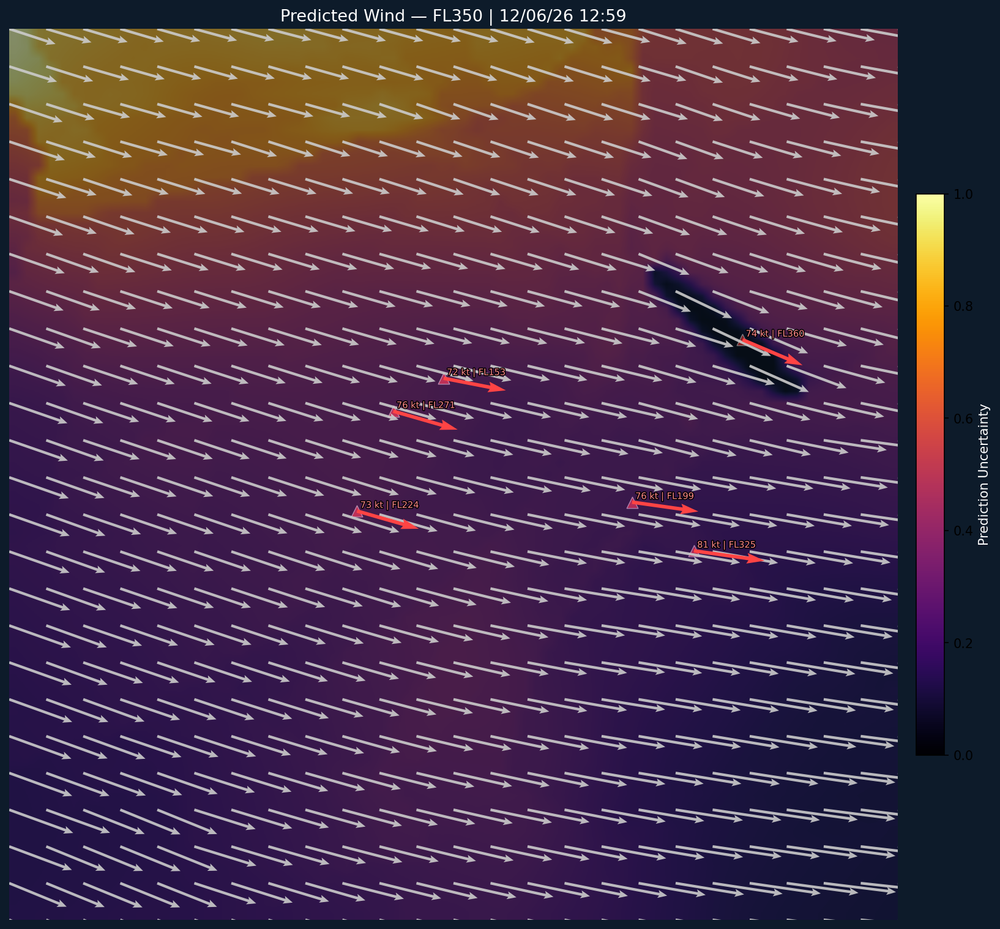

# ADS-B Wind Map

An Attentive Neural Process (ANP) that predicts wind vectors from ADS-B aircraft observations. Given a set of aircraft-derived wind measurements (direction and speed) at known positions, the model learns to interpolate wind fields across a region and quantify its own uncertainty.

## How it works

A Raspberry Pi running [dump1090](https://github.com/antirez/dump1090) collects ADS-B position reports from nearby aircraft. Each aircraft's reported ground track and airspeed, compared against its expected behaviour, yields a single wind observation (direction, speed) at a lat/lon/altitude. Over time, thousands of these observations accumulate into "snapshots" of the local wind field.

## Architecture

The model is an [Attentive Neural Process](https://arxiv.org/abs/1901.05761) — a conditional generative model that maps a set of observed context points to a predictive distribution over query locations.

**Encoders.** Two parallel encoding paths process the context set `{(x_i, y_i)}`:

- **Latent encoder** — aggregates context into a global stochastic variable `z ~ N(mu, sigma)` via self-attention over context pairs followed by mean-pooling. This captures overall wind regime uncertainty (epistemic).
- **Deterministic encoder** — produces a per-target representation `r*` via self-attention followed by multi-head cross-attention from target queries to context keys. This captures local spatial structure conditioned on nearby observations.

**Decoder.** Concatenates `r*`, `z`, and the target position `x*`, then passes them through an MLP to output per-point mean and standard deviation of the predictive wind distribution.

Both encoders use pre-norm Transformer blocks (scaled dot-product self-attention + position-wise FFN) rather than the simple MLPs in the original ANP paper.

**Training.** Optimised via the negative ELBO: reconstruction log-likelihood under the predictive distribution minus KL divergence between the posterior (from target observations) and prior (from context only). Direction is encoded as `(sin, cos)` to respect circularity.

## Requirements

- Python 3.10+
- PyTorch 2.x
- NumPy
- tqdm
- Matplotlib
- Pillow
- scipy (for animated visualisations)
- contextily (for basemap tiles)
- scikit-optimize (for hyperparameter search)
